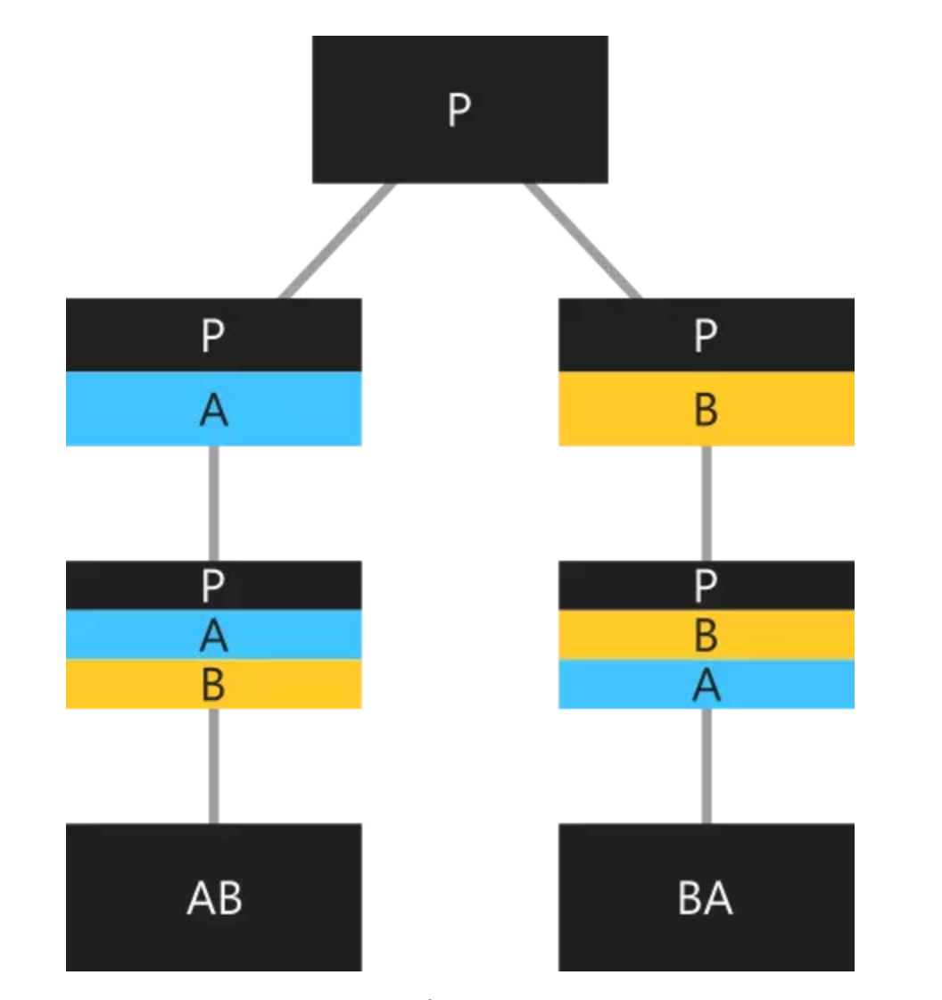

# Mixin

Mixins可以通过普通的类声明隐式定义：

```dart
class Walker {
  void walk() {
    print("I'm walking");
  }
}
```

如果我们不想让我们创建的mixin被实例化或扩展，我们可以像这样定义它：

```Dart
abstract class Walker {
  // This class is intended to be used as a mixin, and should not be
  // extended directly.
  factory Walker._() => null;

  void walk() {
    print("I'm walking");
  }
}
```

要使用mixin的话，你需要使用with关键字，后跟一个或多个mixin的名称：

```Dart
class Cat extends Mammal with Walker {}

class Dove extends Bird with Walker, Flyer {}
```

再来看示例：

```
class A {
  String getMessage() => 'A';
}

class B {
  String getMessage() => 'B';
}

class P {
  String getMessage() => 'P';
}

class AB extends P with A, B {}

class BA extends P with B, A {}

void main() {
  AB ab = AB();
  print(ab.getMessage()); // B

  BA ba = BA();
  print(ba.getMessage()); // A
}
```




参考：

* [https://www.jianshu.com/p/a578bd2c42aa](https://www.jianshu.com/p/a578bd2c42aa)
* [https://medium.com/flutter-community/dart-what-are-mixins-3a72344011f3](https://medium.com/flutter-community/dart-what-are-mixins-3a72344011f3)


