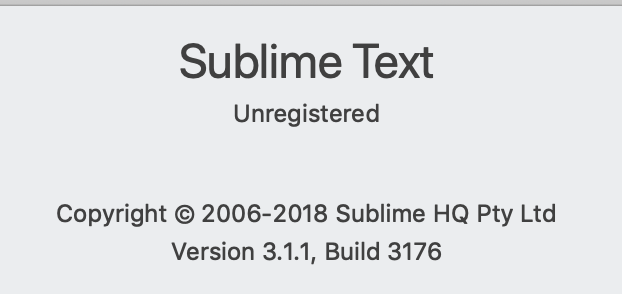

# Python

###学习链接推荐
- [Python菜鸟教程](https://www.runoob.com/python3/python3-tutorial.html)
- [Python官网](https://www.python.org/)
- [Python文档](https://www.python.org/doc/)
- [Python中文手册](https://www.runoob.com/manual/pythontutorial3/docs/html/introduction.html)
- [Python源代码](https://www.python.org/downloads/source/)
- [Python线上运行](https://www.runoob.com/try/runcode.php?filename=HelloWorld&type=python3)
- [python flask 教程](https://pan.baidu.com/s/1saj1pEHf0v92JpFe2F6vkA)提取码: qp85 

###Sublime Text 3 增加Python解释器支持

试验环境：
我的Sublime Text版本3.1.1



操作系统：Mac OS

[参考链接](https://blog.csdn.net/weixin_41768008/article/details/79859008)

**首先确保本地已可运行python命令**
```python
python3
Python 3.7.2 (default, Feb 18 2019, 14:58:37) 
[Clang 10.0.0 (clang-1000.11.45.5)] on darwin
Type "help", "copyright", "credits" or "license" for more information.
```

**查看本地python3解释器所在位置**

```python
liuweizhendeMacBook-Pro-2:~ liuweizhen$ which a python3
/usr/local/bin/python3

// 也可以：
liuweizhendeMacBook-Pro-2:~ liuweizhen$ type -a python3
python3 is /usr/local/bin/python3
```

**对sublime增加解释器支持**
Sublime Text > Tools > Build System > New Build System

```python
{
	"shell_cmd": "make"
}
```
替换成上面通过命令找到的python3解释器路径：
```python
{
	"cmd": ["/usr/local/bin/python3"],
}
```
command+s保存，弹出弹框名字为**untitled.sublime-build**


可更改名字，但后缀.sublime-build不可改动

**测试**

新建`hello.py`

```python
#!/usr/bin/python3

print("Hello world!")
```
command+b，下面控制台打印：
```
Hello world!
[Finished in 0.2s]
```
Test
