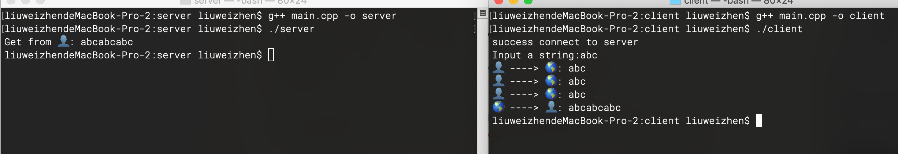

# TCP粘包问题

**缓冲区**
每个 socket 被创建后，都会分配两个缓冲区，输入缓冲区和输出缓冲区:


这些I/O缓冲区特性可整理如下：
- I/O缓冲区在每个TCP套接字中单独存在；
- I/O缓冲区在创建套接字时自动生成；
- 即使关闭套接字也会继续传送输出缓冲区中遗留的数据;
- 关闭套接字将丢失输入缓冲区中的数据;

输入输出缓冲区的默认大小可以通过 getsockopt() 函数获取：

```C
int sock = socket(AF_INET, SOCK_STREAM, IPPROTO_TCP);
unsigned optVal;
socklen_t optLen = sizeof(int);
getsockopt(sock, SOL_SOCKET, SO_SNDBUF, (void*)&optVal, &optLen);
printf("缓冲区大小: %d字节\n", optVal); // 缓冲区大小: 131072字节
```

**阻塞模式**
TCP套接字默认情况下是阻塞模式，也是最常用的，在这种模式下：
当使用 write()/send() 发送数据时：
1. 首先会检查缓冲区，如果缓冲区的可用空间长度小于要发送的数据，那么 write()/send() 会被阻塞（暂停执行），直到缓冲区中的数据被发送到目标机器，腾出足够的空间，才唤醒 write()/send() 函数继续写入数据。
2. 如果TCP协议正在向网络发送数据，那么输出缓冲区会被锁定，不允许写入，write()/send() 也会被阻塞，直到数据发送完毕缓冲区解锁，write()/send() 才会被唤醒。
3. 如果要写入的数据大于缓冲区的最大长度，那么将分批写入。
4. 直到所有数据被写入缓冲区 write()/send() 才能返回。

当使用 read()/recv() 读取数据时：
1. 首先会检查缓冲区，如果缓冲区中有数据，那么就读取，否则函数会被阻塞，直到网络上有数据到来。
2. 如果要读取的数据长度小于缓冲区中的数据长度，那么就不能一次性将缓冲区中的所有数据读出，剩余数据将不断积压，直到有 read()/recv() 函数再次读取。
3. 直到读取到数据后 read()/recv() 函数才会返回，否则就一直被阻塞。

这就是TCP套接字的阻塞模式。所谓阻塞，就是上一步动作没有完成，下一步动作将暂停，直到上一步动作完成后才能继续，以保持同步性。

**粘包问题**
由于缓冲区的存在和阻塞模式，数据的接收和发送不一定是同步的，即read()/recv() 和 write()/send() 的执行次数可能不同。
例如，write()/send() 重复执行三次，每次都发送字符串"abc"，那么目标机器上的 read()/recv() 可能分三次接收，每次都接收"abc"；也可能分两次接收，第一次接收"abcab"，第二次接收"cabc"；也可能一次就接收到字符串"abcabcabc"。

假设我们希望客户端每次发送一位学生的学号，让服务器端返回该学生的姓名、住址、成绩等信息，这时候可能就会出现问题，服务器端不能区分学生的学号。例如第一次发送 1，第二次发送 3，服务器可能当成 13 来处理，返回的信息显然是错误的。

这就是数据的“粘包”问题，客户端发送的多个数据包被当做一个数据包接收。也称数据的无边界性，read()/recv() 函数不知道数据包的开始或结束标志（实际上也没有任何开始或结束标志），只把它们当做连续的数据流来处理。

下面的代码演示了粘包问题，客户端连续三次向服务器端发送数据，服务器端却一次性接收到所有数据：
[http://c.biancheng.net/view/2350.html](http://c.biancheng.net/view/2350.html)演示了在Windows环境下的代码，下面我们先一个在Linux下的演示代码：

**server**
```C
#include <iostream>
#include <stdlib.h>
#include <sys/socket.h>
#include <netinet/in.h>
#include <arpa/inet.h>
#include <unistd.h>

#define BUF_SIZE 100

int main(int argc, const char * argv[]) {
    struct sockaddr_in serv_addr;
    memset(&serv_addr, 0, sizeof(serv_addr));
    serv_addr.sin_family = AF_INET;
    serv_addr.sin_addr.s_addr = inet_addr("30.16.104.105");
    serv_addr.sin_port = htons(1234);
    
    int serv_sock = socket(AF_INET, SOCK_STREAM, IPPROTO_TCP);
    bind(serv_sock, (const struct sockaddr *)&serv_addr, sizeof(serv_addr));
    
    listen(serv_sock, 20);
    
    struct sockaddr_in clnt_addr;
    socklen_t clnt_addr_size = sizeof(clnt_addr);
    int clnt_sock = accept(serv_sock, (struct sockaddr *)&clnt_addr, &clnt_addr_size);
    
    sleep(10); // 暂停10秒

    // 接收客户端发来的数据，并原样返回
    char buffer[BUF_SIZE] = {0};
    ssize_t recv_len = recv(clnt_sock, buffer, BUF_SIZE, 0);
    printf("Get from 👤: %s\n", buffer);
    send(clnt_sock, buffer, recv_len, 0);
    
    close(clnt_sock);
    close(serv_sock);
    
    return 0;
}
```

**client**
```C
#include <iostream>
#include <stdlib.h>
#include <unistd.h>
#include <arpa/inet.h>
#include <sys/socket.h>

#define BUF_SIZE 100

int main(int argc, const char * argv[]) {
    struct sockaddr_in serv_addr;
    memset(&serv_addr, 0, sizeof(serv_addr));
    serv_addr.sin_family = AF_INET;
    serv_addr.sin_addr.s_addr = inet_addr("30.16.104.105");
    serv_addr.sin_port = htons(1234);
    
    int sock = socket(AF_INET, SOCK_STREAM, IPPROTO_TCP);
    int flag = connect(sock, (struct sockaddr*)&serv_addr, sizeof(serv_addr));
    if (flag == 0) {
        printf("success connect to server\n");
    }
    else {
        printf("fail connect to server\n");
        return 0;
    }
    
    char bufSend[BUF_SIZE] = {0};
    printf("Input a string:");
    // gets(bufSend);
    scanf("%s", bufSend);
    for (int i = 0; i < 3; i++) {
        printf("👤 ----> 🌎: %s\n", bufSend);
        send(sock, bufSend, strlen(bufSend), 0);
    }

    char bufRecv[BUF_SIZE] = {0};
    recv(sock, bufRecv, BUF_SIZE, 0);
    printf("🌎 ----> 👤: %s\n", bufRecv);
    
    close(sock);
    
    return 0;
}
```



[Demo]


