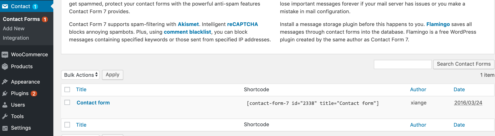
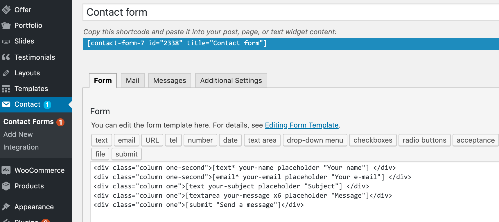
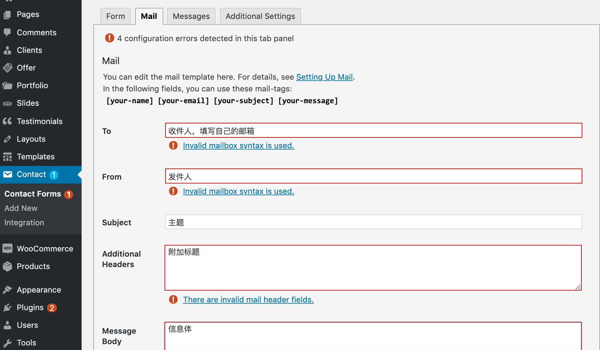

# CF7插件

CF7插件用来做“联系我们”留言板。 访客填写信息留言后，网站会把这些信息发送到指定邮箱。CF7是免费的。

这个插件管理位置在：联系(Contact)
上图所示的留言板引用的是：`[contact-form-7 id="2338" title="Contact form"]`对应的位置是：
Contact（联系） > Contact Forms下面Contact form

要使用访客留言可以发送到正确的邮箱，还需要填写邮箱信息：

