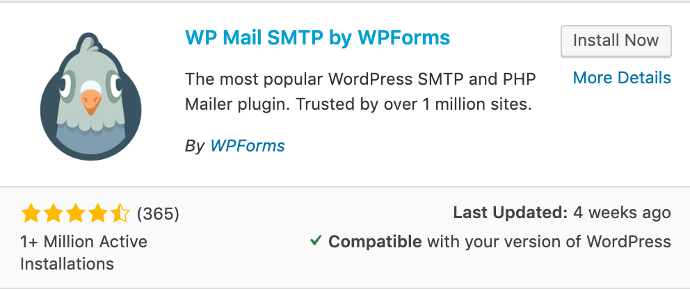

# CF7插件

CF7插件用来做“联系我们”留言板。 访客填写信息留言后，网站会把这些信息发送到指定邮箱。CF7是免费的。

原理：  
CF7 + 插件 + 第三方SMTP  
表单信息 -&gt; CF7插件 -&gt; 主机具有发邮件功能 或者 \[SMPT插件 + 第三方SMTP服务器\] -&gt; 管理员邮箱

这个插件管理位置在：联系\(Contact\)  
上图所示的留言板引用的是：`[contact-form-7 id="2338" title="Contact form"]`对应的位置是：  
Contact（联系） &gt; Contact Forms下面Contact form  
  
  

**Step 1&gt; 安装SMTP插件**  
借助第三方邮箱服务器发邮件需要一个SMTP插件，比如：  

**Step 2&gt; 通过第三方邮件平台获取授权码**  
比如QQ邮箱的设置里，通过发短信的方式获取IMAP/SMTP授权码  
**Step 3&gt; 设置WP Mail SMTP**  
Settings &gt; WP Mail SMTP

* From Email: 填写自己的Email ==&gt; 示例：123456789@qq.com
* From Name: 对方看到的邮箱名 ==&gt; 示例：123456789@163.com
* SMTP Host: SMTP服务器地址 ==&gt; QQ的是 smtp.qq.com
* Encryption: 可以勾选SSL
* SMTP Port: 如果勾选了SSL，则此处对应填写，QQ和163的是465
* Aoto TLS: 不必要选中
* Authentication: ON 打开
* SMTP Username: SMTP用户名，和上面From Eamil是一样的，即自己的邮箱
* SMTP Password: SMTP密码 注：这个密码不是网页登录密码，而是腾讯/网易给的IMAP/SMTP授权码

**Step 4&gt; 设置CF7表单的Mail**
Contact > 在这些表单列表中找到要编辑的表单 > Edit > Mail

- To: 收件人，示例：123456789@qq.com
- From: 收件人，示例：[your-name]<123456789@qq.com>

