# 基本操作

http://yu571510000(0).my3w.com/wp-admin/

- 操作地址：thin.....com/wp-admin/
- 数据库reset
  安装插件Database Reset -> 工具 -> Reset Tables
- 指定某一页面为首页  
  外观 -> 自定义 -> 主页设置 也可以在：设置 -> 阅读中设置
- 页头 
  页头属于公共区域，不是在页面中修改，页头分为两部分区域，一个是顶部，第二个是logo,菜单小图标等
  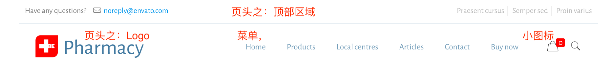
  - 页头之顶部区域：BeTheme > Theme Option > Menu & Action Bar (菜单和操作栏, Menu就是菜单，Action Bar即页头的顶部)
  - 页头的搜索小图标   

    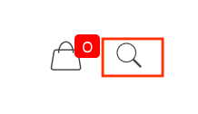
    - BeTheme > Theme Options > Header & Subheader (页眉和子页眉) > Extras (扩展) > Search
  - 页头的购物车小图标
    - BeTheme > Theme Options > Blog, Portfolio & Shop (博客，作品集&商店) > Shop 把最下面的Cart | Icon输入内容置空即隐藏

    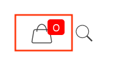
  - 页头上的操作按钮（菜单栏右侧） 
    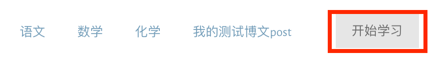
    - BeTheme > Theme Options > Header & Subheader (页眉和子页眉) > Action Button (操作按钮)
    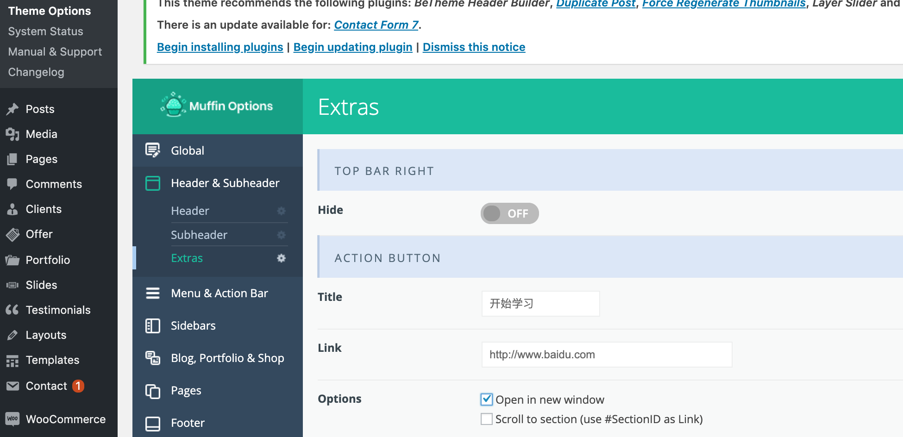
  - 页头悬浮的取消
    - BeTheme > Theme Options > Header & Subheader > Header > Sticky
  - 顶部菜单：Appearance > Menus，这里的Social Menu Top（顶部社交菜单）即是：
  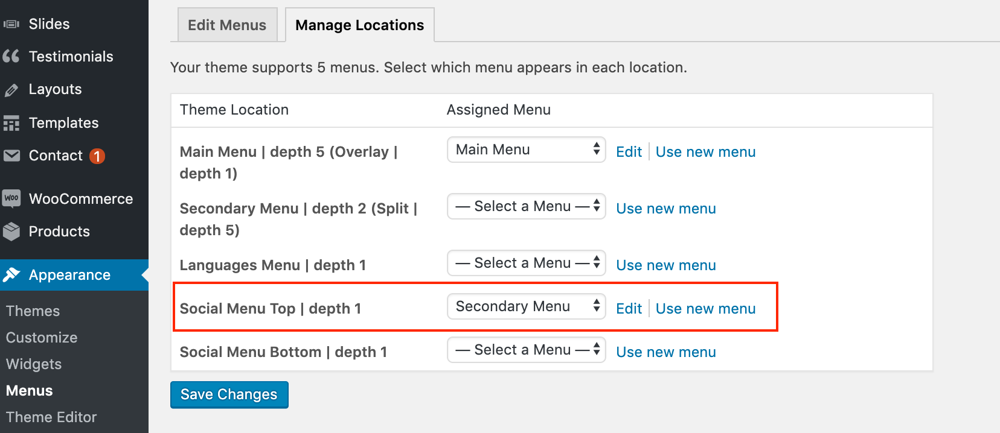
  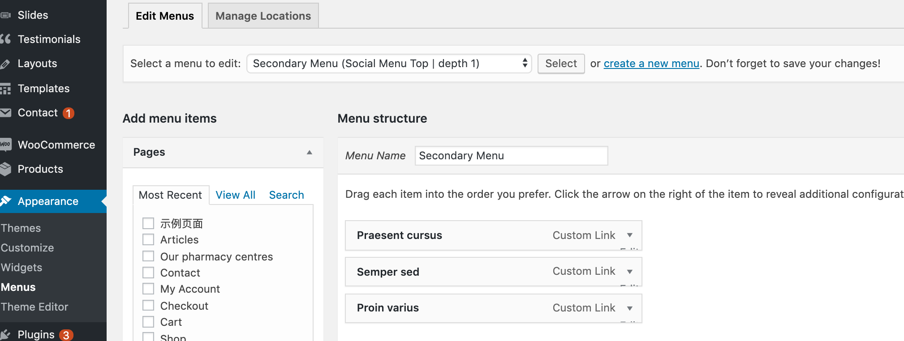
- 页脚
  - BeTheme > Theme Options > Footer（页脚）可以修改Layout、Style、Padding、Position...
  - 页脚内容修改：Appearance > Widgets > Footer | #1234
  - 页脚小图标的修改：BeTheme > Theme Options > Blog, Portfolio & Shop > Shop > 最下面的Cart | Icon > 选中某一Icon, 名字会显现出来，然后在代码中比如：`<li><i class="icon-layout" style="color:#4179a0">`改class
    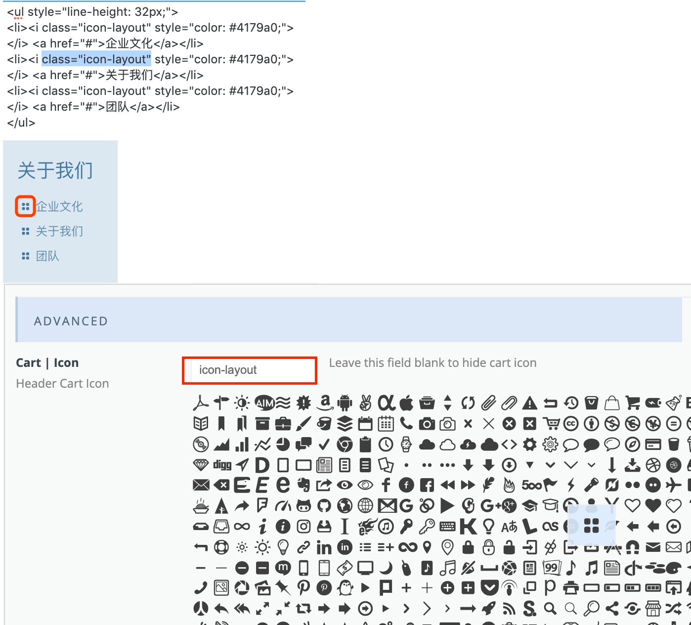
  - 页脚的版权信息 BeTheme > Theme Options > Footer > Advance > Copyright
  - 页脚的回到顶部按钮 BeTheme > Theme Options > Footer > Extras > Back to Top button

- 网站Logo标志
  - BeTheme > Theme Options > Global(全局) > Logo 其中Retina Logo的宽高都是普通Logo的2倍，最好是png图片, png图片可以透明
- 全局颜色修改
  - BeTheme > Theme Options > Colors
- 编辑器常用名词
  - Section: 区，区域，一篇博文就是由许多Section组成
    - Wrap: 一个Section下可以添加多个Wrap, Wrap表示列或外套
      - Item: 一个Wrap下可以添加多个Item, Item表示项。Item有很多形式，比如Image, Button以及常用的Column
    - Divider: 分隔符
- 菜单 
  - Appearance > Menus 
  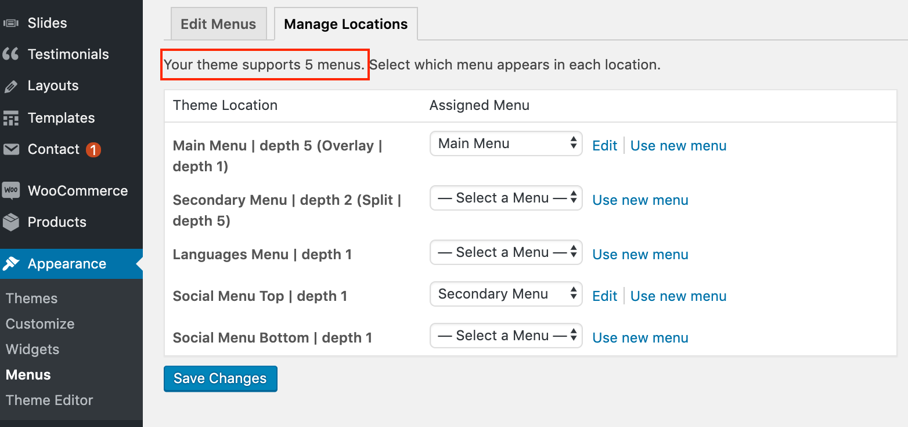
  可以编辑新建多个菜单，但BeTheme主题仅支持在5个地方显示菜单
- 幻灯片 
- 商城插件 
- 广告位 
- 文章(Posts) 
  - 文章位置：BeTheme > All Posts 
- 文章分类
  - BeTheme > Posts > Categories > Name（更改名字） Slug(别名)
- 博客幻灯 (Blog Slider)
  - 在Blog Slider中有一个Category, 即博客的类别，选中哪一个类别，就表示使用这个类别下面的文章
  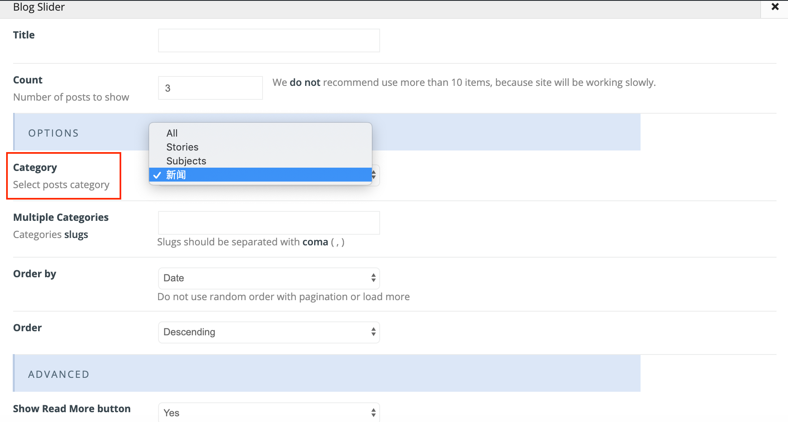
  - 类别在BeTheme > Posts > Categories下设置  
    
- 分频器（Divider）
  - 分频器只是用来撑高
- 页脚 在主题选项的小工具里面修改 
- 分类目录 
- 编辑页面 
  页面 -> 找到要编辑的页面，点击编辑  Muffin Builder是BeTheme主题自带的编辑器
- 幻灯片
  - 修改幻灯片样式：点击Slider Revolution 可以: 
    - 修改现有幻灯片样式
    - 对现有幻灯片样式复制备份
    - 新建或在模板上新建(应只有零售版才有)
    - 导入幻灯片样式
  - 显示左右小箭头
    - Slider Revolution -> 在All Slider中可以备份和Duplicate, 然后修改，修改后在Slider setting中右侧Navigation -> Enable Arrows
  - 更改选择某一个幻灯片样式
    - 选择有幻灯片的某一页面 -> 编辑 -> 从Revolution Slider列表中选择某一幻灯片样式
  - 控制幻灯片切换时间
    - Slider Revolution -> Slider Settings -> General Settings -> Defaults -> Default Slide Duration 或者在All Slides中编辑某一幻灯片：
    - General Settings -> Slide Delay: 填入时间，单位毫秒

- BeTheme主题中文汉化 
  - 把zh_CN.mo上传至：/wp-content/themes/betheme/languages/
  - 在WordPress的设置 -> 常规 -> 站点语言，改成简体中文
  - 注：也可以自己使用poedit软件编写.po文件并生成.mo汉化包并上传使用（.po是源文件，.mo是导出的使用文件）
  - 如果想再变回英文，可以把这个.mo文件删掉 或者：在设置 -> 常规 -> 站点语言里改成英文
- 侧边栏小工具 Sidebar Widget
  - 侧边栏需要在外观 > 小工具中操作，添加，编辑，然后在编辑页面时选择
  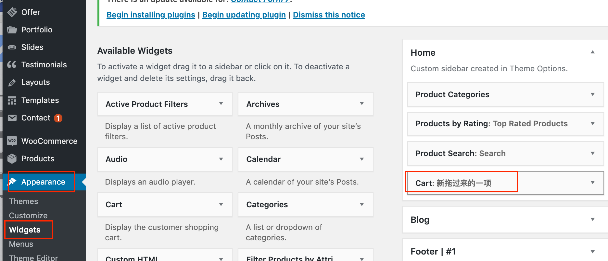  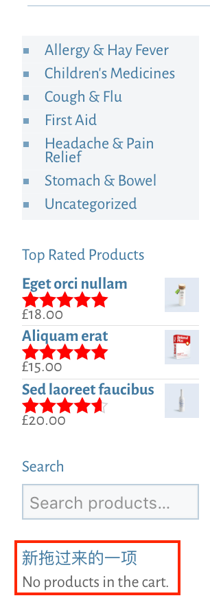
- 浏览器显示的网站标题
  - Settings -> Site Title （网站名）
  - Settings -> Tagline(浏览器显示的标题)
  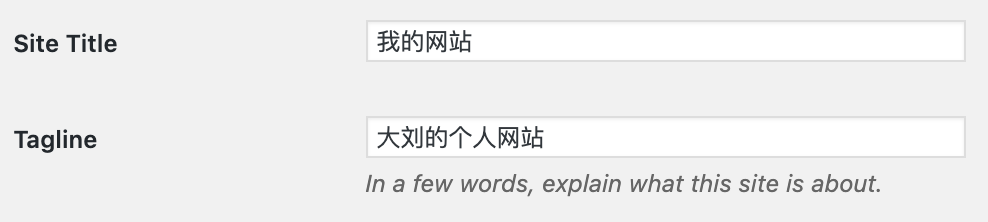
  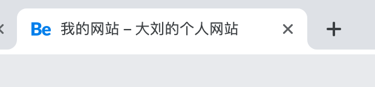

- 常见插件
  - 说明：购买主题一般自动打包在里面有一些常用插件，主题里的插件升级不可以单独进行，即需要看主题是否提供了升级功能。主题本身什么时候给予了插件更新，这些插件才可以更新。说白了，这些插件是主题的捆绑插件(Bundled Plugins)。这些插件都可以在[https://themeforest.net/](https://themeforest.net/)的Code选项里找到。在主题里的每个Demo可能都需要不同的插件，点击Install，完成后Active激活即可。插件够用就可以，只安装必要插件即可。
  - Revolution Slider: 幻灯片插件
  - Contact Form7: 在线留言发邮件插件
  - WooCommerce: 商城插件
