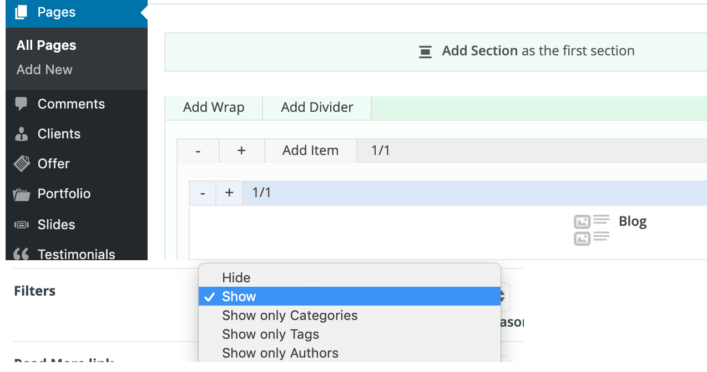

# 新闻博客

在导入BeTheme主题时有一个BUG, 很多Demo发现新闻项Articles为空。  
需要手动修改下页面：BeTheme &gt; Pages &gt; Articles &gt; Edit &gt; Add Item &gt; Search "Blog" and add it.

**搜索选项Filter**Pages &gt; 选择某一Page &gt; Edit &gt;  
Category: All  
Filters: Show  
Pagination: 分页：YES

**去除侧边  
**Appearance &gt; Widges &gt; Blog &gt; Meta: Meta &gt; Delete

**隐藏博客详情导航箭头  
**BeTheme &gt; Theme Options &gt; Blog, Portfolio & Shop &gt; General &gt; Navigation &gt; Hide ...

