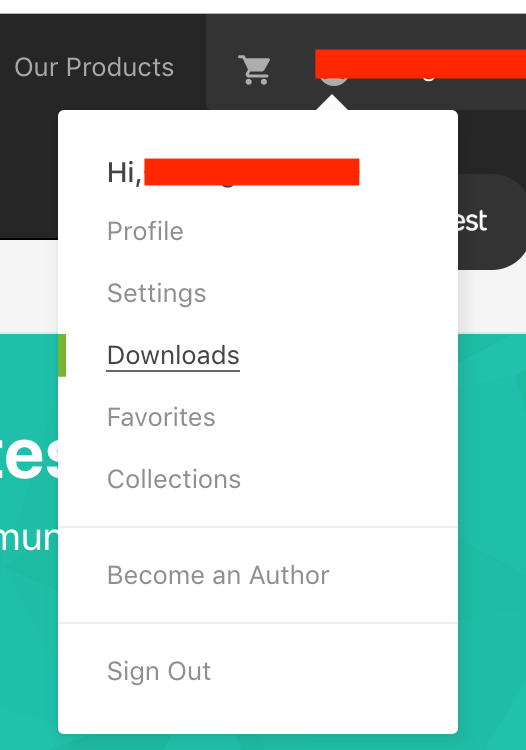
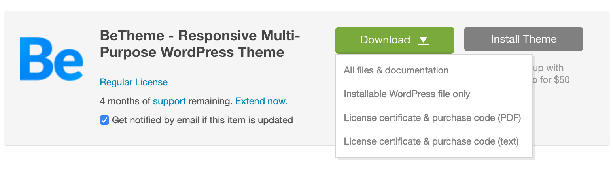

# 购买和配置主题

进入[https://themeforest.net](https://themeforest.net)，这需要一个envatomarket帐号，envatomarket中售卖很多东西，比如主题，代码，视频等，我们找到WebThemes & Templates -> WordPress -> 然后找到BeTheme主题购买，Buy license, BeTheme的主题一般是59美元。evatomarket有可能需要翻墙才可访问。

购买成功后在Downloads下面下载.

- All files & documentation 完整包和文档
- Installable WordPress file only 安装的主题包
- License certificate & purchase code (PDF/text) PDF格式和txt格式的license

**上传BeTheme主题包**
外观 -> 主题 -> 添加 -> 上传主题（是安装包，不是完整包）... 安装成功后，点击启用。
这是建议的操作，如果行不通，则：
使用FTP软件比如FileZilla把主题包（是安装包，不是完整包）上传到wordpress/wp-content/themes下。上传好后再解压即可。

**填写License**
接下来在BeTheme -> Welcome -> Theme Registration中填入License，即商业授权（购买代码）

**安装预建站点：Pre-built websites**
在Pre-built websites中找到符合自己的站点，Install后以后就在此预建站点基础之上修改。这里的预建站点即我们通常说的“Demo”，安装Demo一般需要一些插件，在Demo所依赖的所有插件安装完毕之后此Demo才正式可用。

