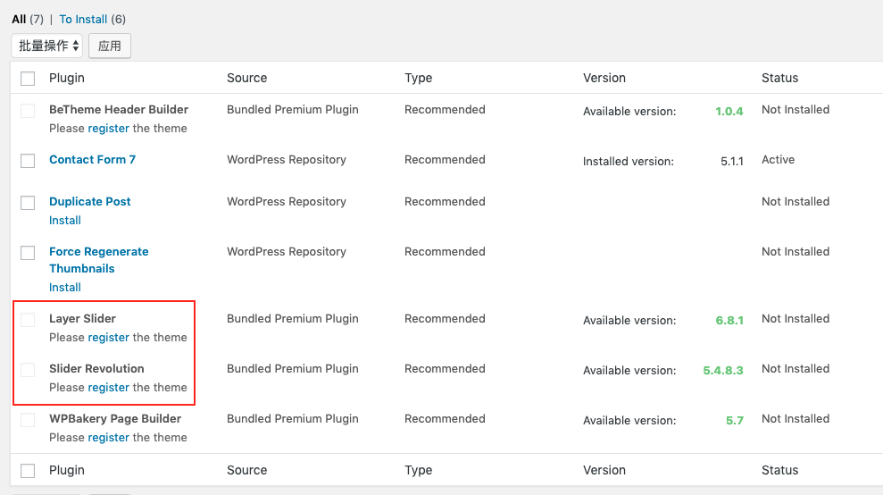

# 遇到的一些问题

**重定向问题**
备案成功后，浏览器输入网址进入到要求输入密码页面，阿里云客服提示重定向过多，解决方法：

[http://ztmao.com/wpjy/4956.html](http://ztmao.com/wpjy/4956.html)

打开`htdocs/wp-includes/canonical.php`文件，修改：

```php
// function redirect_canonical( $requested_url = null, $do_redirect = true ) {
function redirect_canonical( $requested_url = null,$do_redirect = false) {
```

**访问网址图片加载异常**
备案成功后，在我的电脑上访问临时域名成功显示内容，但其他人访问图片加载不出来。
解决方法：

在wordpress的仪表盘的设置 -> 常规 里，修改WordPress址址和站点地址为备案成功后的地址。备案成功后这两个地址一定要更改，否则无法正常访问。


**插件无法安装**
在安装Slider Revolution等插件时提示`Please register the theme`，而Item Purchase Code已注册主题，插件安装项checkbox置灰无法勾选，如图所示：


排查原困：按照提示意思是BeTheme主题未注册，但实际上已注册。问题出现在注册的BeTheme主题绑定的域名和现在的不一致，出现这个问题的操作是我当时购买BeTheme主题设置绑定的域名是临时域名，真实域实审核通过后在WordPress的设置选项中已更换为新公共域名，但原来BeTheme绑定域名是以前的临时域名。
解决方法：
[论坛文章](https://forum.muffingroup.com/betheme/discussion/36219/cannot-register-deregister-your-license-key-use-this-tool)
在[http://api.muffingroup.com/licenses/](http://api.muffingroup.com/licenses/)输入购买代码和用户名，deregister
这样购买的BeTheme license就和老Domain解绑了，然后再在wordpress的Dashboard中重新输入license即可。

输入license(即Item Purchase Code之后)，wordpress会提示注册成功，为了验证，也可以在[http://api.muffingroup.com/licenses/](http://api.muffingroup.com/licenses/)查看这个license所注册的域名。


