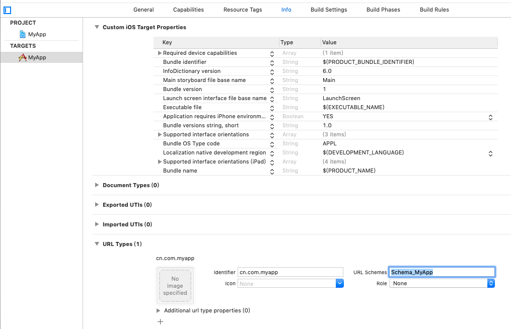
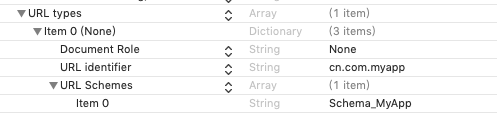
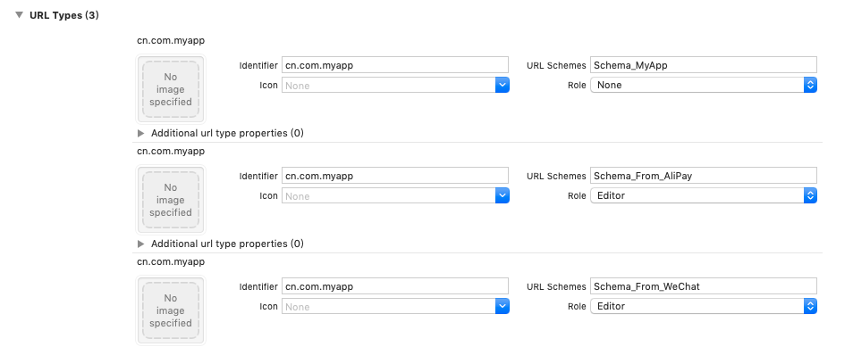

# App之间跳转

先来看打开其他APP的代码：

```Objective-C
NSURL *url = [NSURL URLWithString:@"SomeApp://xxx"];
if ([[UIApplication sharedApplication] canOpenURL:url]) {
    [[UIApplication sharedApplication] openURL:url];
}
```

代码`[[UIApplication sharedApplication] canOpenURL:url]`会查找`Info.plist`下`LSApplicationQueriesSchemes`选项中是否存在`SomeApp`，如果存在则表示`can open`，通常配置在	`LSApplicationQueriesSchemes`选项中的Schema名字即白名单
代码`[[UIApplication sharedApplication] openURL:url]`即打开url, 即打开schema为`SomeApp`的应用。即这个`SomeApp`需要在其Info.plist中的URL types中配置形如：
- URL types
  - item0
    - URL identifier: 此应用的identififier
    - URL Schemes
      - item0: SomeApp

思路明确，要从A打开B，需要:
1. 在A的Plist文件的LSApplicationQueriesSchemes选项中配置Schema名称
2. 在B的Plist文件的URL type选项中配置Schema.

同理，如果要从B打开A，需要：
1. 在B的Plist文件的LSApplicationQueriesSchemes选项中配置Schema名称
2. 在A的Plist文件的URL type选项中配置Schema.

不过，经试验发现，如果不设置`LSApplicationQueriesSchemes`，而强制调用`[[UIApplication sharedApplication] openURL:url]`也是可以工作的，但通常我们不这么干。

另外，比如从B跳回A，则会回调方式：

```Objective-C
+ (BOOL)application:(UIApplication *)application openURL:(NSURL *)url sourceApplication:(NSString *)sourceApplication annotation:(id)annotation
```

接下来我们写三个App: `MyApp`，`AliPay`，`WeChat`, 从MyApp里可以分别跳转到AliPay和WeChat中完成支付，然后再跳转回来并传一些参数。

我们先在这三个APP里编辑URL Types以表示自己的Schema，可以在Info.plist中添加`URL types`，也可以在TARGETS->Info->URL Types中直接编辑：


这样编辑好后，发现Info.plist中也自动添加了相应描述：


同样编辑`AliPay`和`WeChat`:
- MyApp
  - Identifier: cn.com.myapp
  - URL Schemes: Schema_MyApp
- AliPay
  - Identifier: cn.com.alipay
  - URL Schemes: Schema_AliPay
- WeChat
  - Identifer: cn.com.alipay
  - URL Schemes: Schema_WeChat

一个APP可以有多个URL Schema, 为了区分，我们再给MyApp添加两个Schema, `Schema_From_AliPay` `Schema_From_WeChat`



