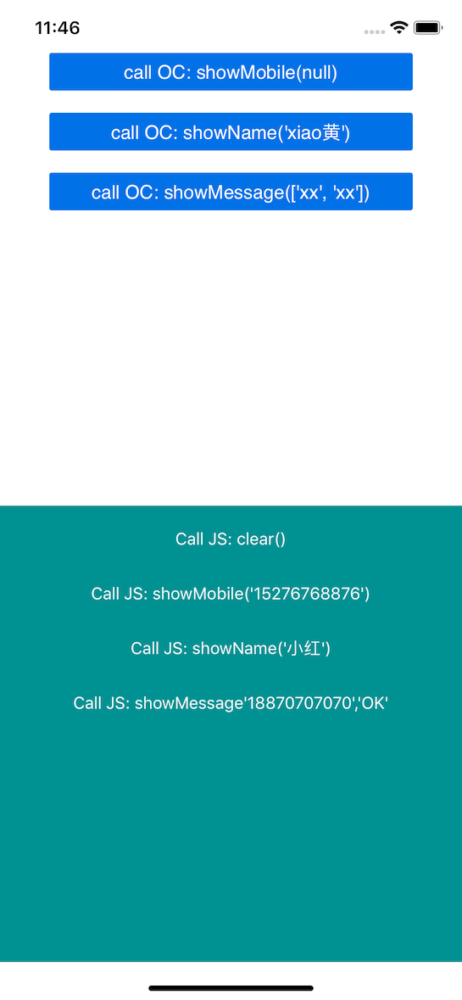

# Frameworks的创建和使用

新建一个Single View App的iOS工程：TestWeakLink, 然后在工程主目录下建一module文件夹，引入这个module文件夹到工程。
再建一个叫MyFramework的库(File -> New -> Project -> Cocoa Touch Framework)，放入module目录中，右键module -> Add files to 'TestWeakLink' -> 把MyFramework/MyFramwork.xcodeproj引入进去


我们新建一个Person类，然后测试：

```Objective-C
@interface Person : NSObject

- (void)eat:(NSString *)food;

@end

@implementation Person

- (void)eat:(NSString *)food {
    NSLog(@"Person eat: %@", food);
}

@end
```

要使用Framework，需要做以下配置：

1. 把Person.h头文件引入MyFramework.h
```Objective-C
#if __has_include(<MyFramwork/MyFramwork.h>)
#import <MyFramwork/Person.h>
#else
#import "Person.h"
#endif
```

2. 把Person.h这个头文件放入Public中


3. 主项目中 -> TARGETS -> Build Phases -> Link Binary With Libraries -> click "+" 加入MyFramework.framework。同理在Target Dependencies中也加入，另外在General下面的Embedded Binaries中也加入


4. 使用：

```Objective-c
#import <MyFramework/MyFramework.h>


@implementation ViewController

- (void)viewDidLoad {
    [super viewDidLoad];
    
    Person *p = Person.new;
    [p eat:@"Fruit"];
}


@end
```
