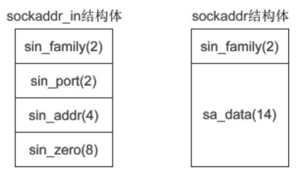

# Linux_Socket常用函数解析

接口查询参考[http://man.he.net/](http://man.he.net/)

**int socket(int af, int type, int protocol)**
- `#include <sys/socket.h>`
- 创建一个socket, 示例：`int serv_sock = socket(AF_INET, SOCK_STREAM, IPPROTO_TCP);`
- 参数af：地址族（Address Family），也就是 IP 地址类型，常用的有 AF_INET 和 AF_INET6。AF 是“Address Family”的简写，INET是“Inetnet”的简写。AF_INET 表示 IPv4 地址，例如 127.0.0.1；AF_INET6 表示 IPv6 地址，例如 1030::C9B4:FF12:48AA:1A2B
注：127.0.0.1，它是一个特殊IP地址，表示本机地址。
也可以使用 PF 前缀，PF 是“Protocol Family”的简写，它和 AF 是一样的。例如，PF_INET 等价于 AF_INET，PF_INET6 等价于 AF_INET6
- 参数type: 数据传输方式/套接字类型，常用的有 SOCK_STREAM（流格式套接字/面向连接的套接字） 和 SOCK_DGRAM（数据报套接字/无连接的套接字）
- 能数protocol:  protocol 表示传输协议，常用的有 IPPROTO_TCP 和 IPPTOTO_UDP，分别表示 TCP 传输协议和 UDP 传输协议. 注：一般情况下有了 af 和 type 两个参数就可以创建套接字了，操作系统会自动推演出协议类型，除非遇到这样的情况：有两种不同的协议支持同一种地址类型和数据传输类型。如果我们不指明使用哪种协议，操作系统是没办法自动推演的。参数指定IPPROTO_TCP即是TCP套接字。
- 如果使用 SOCK_DGRAM 传输方式，那么满足这两个条件的协议只有 UDP，因此可以这样来调用 socket() 函数：`int udp_socket = socket(AF_INET, SOCK_DGRAM, IPPROTO_UDP);  //IPPROTO_UDP表示UDP协议`, 这种套接字称为 UDP 套接字。
- 上面两种情况都只有一种协议满足条件，可以将 protocol 的值设为 0，系统会自动推演出应该使用什么协议，如下所示：
```
int tcp_socket = socket(AF_INET, SOCK_STREAM, 0);  //创建TCP套接字
int udp_socket = socket(AF_INET, SOCK_DGRAM, 0);  //创建UDP套接字
```
**int bind(int sockfd, const struct sockaddr *addr, socklen_t addrlen)**
- 将套接字和IP、端口绑定
- sock 为 socket 文件描述符，addr 为 sockaddr 结构体变量的指针，addrlen 为 addr 变量的大小，可由 sizeof() 计算得出。
- 下面的代码，将创建的套接字与IP地址 127.0.0.1、端口 1234 绑定：
```C
#include <sys/types.h>
#include <sys/socket.h>
//创建套接字
int serv_sock = socket(AF_INET, SOCK_STREAM, IPPROTO_TCP);
//创建sockaddr_in结构体变量
struct sockaddr_in serv_addr;
memset(&serv_addr, 0, sizeof(serv_addr));  //每个字节都用0填充
serv_addr.sin_family = AF_INET;  //使用IPv4地址
serv_addr.sin_addr.s_addr = inet_addr("127.0.0.1");  //具体的IP地址
serv_addr.sin_port = htons(1234);  //端口
//将套接字和IP、端口绑定
bind(serv_sock, (struct sockaddr*)&serv_addr, sizeof(serv_addr)); // 这里我们使用 sockaddr_in 结构体，然后再强制转换为 sockaddr 类型，后边会讲解为什么这样做
```

**sockaddr_in**
- 结构体(一般用作套接字地址)
- 成员变量：
```C
struct sockaddr_in{
    sa_family_t     sin_family;   //地址族（Address Family），也就是地址类型
    uint16_t        sin_port;     //16位的端口号
    struct in_addr  sin_addr;     //32位IP地址
    char            sin_zero[8];  //不使用，一般用0填充
};
```
- 示例：
```C
struct sockaddr_in serv_addr; // 套接字地址
memset(&serv_addr, 0, sizeof(serv_addr)); // 每个字节都用0填充
serv_addr.sin_family = AF_INET; // 使用IPv4地址
serv_addr.sin_addr.s_addr = inet_addr("30.16.104.56"); // IP地址
serv_addr.sin_port = htons(1234); // 端口号
```
- 参数sin_family 和 socket() 的第一个参数的含义相同，取值也要保持一致
- 参数sin_port为端口号。uint16_t 的长度为两个字节，理论上端口号的取值范围为 0~65536，但 0~1023 的端口一般由系统分配给特定的服务程序，例如 Web 服务的端口号为 80，FTP 服务的端口号为 21，所以我们的程序要尽量在 1024~65536 之间分配端口号。端口号需要用 htons() 函数转换。
- 参数sin_addr是struct in_addr 结构体类型的变量，该结构体只包含一个成员：
```C
struct in_addr{
    in_addr_t  s_addr;  //32位的IP地址
};
```
in_addr_t 在头文件 <netinet/in.h> 中定义，等价于 unsigned long，长度为4个字节。也就是说，s_addr 是一个整数，而IP地址是一个字符串，所以需要 inet_addr() 函数进行转换，例如：
```C
unsigned long ip = inet_addr("127.0.0.1");
printf("%ld\n", ip); // 16777343
```
- 参数sin_zero[8] 是多余的8个字节，没有用，一般使用 memset() 函数填充为 0。上面的代码中，先用 memset() 将结构体的全部字节填充为 0，再给前3个成员赋值，剩下的 sin_zero 自然就是 0 了

注：bind() 第二个参数的类型为 sockaddr，而代码中却使用 sockaddr_in，然后再强制转换为 sockaddr，这是为什么呢？
sockaddr 结构体的定义如下：
```C
struct sockaddr{
    sa_family_t  sin_family;   //地址族（Address Family），也就是地址类型
    char         sa_data[14];  //IP地址和端口号
};
```
下图是 sockaddr 与 sockaddr_in 的对比（括号中的数字表示所占用的字节数）：



**htons**
htonl, htons, ntohl, ntohs -- convert values between host and network
     byte order
即：htonl, htons, ntohl, ntohs这4个函数转换主机节序和网络的字节序。网络中使用大端big endian, 大字节在前
htonl: Host TO Network Long  ==> uint32_t htonl(uint32_t hostlong);
htons: Host To Network Short ==> uint16_t htons(uint16_t hostshort);
ntohl: Network To Host Long  ==> uint32_t ntohl(uint32_t netlong);
ntohs: Network To Host Short ==> uint16_t ntohs(uint16_t netshort);


