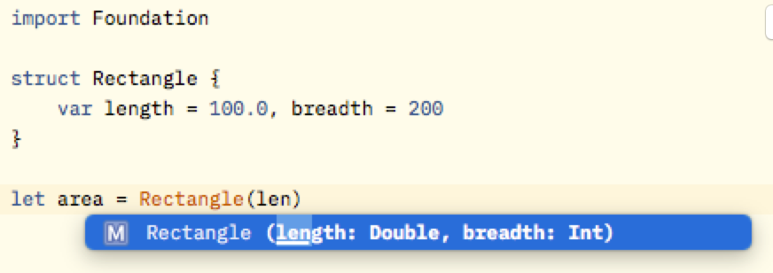

# Swift基本语法

#### ?和!
```Swift
var myString: String? // 可能没有值(none)，或有一个类型为String的值
//var myString: Optional<String>
myString = "Hello, Swift!"
if myString != nil {
    print(myString) // Optional("Hello, Swift!")
}
else {
    print("It's null!")
}

import Foundation

//var myString: String! = nil
var myString: String!
print(myString) // none

if myString == nil {
    print("It's none!”)
}
```

#### 函数
Swift 函数参数可以同时有一个局部名称（在函数体内部使用）和一个外部名称（在调用函数时使用)
```Swift
// 局部参数名
func eat(food: String) -> Void {
    print("eat \(food)")
}

// 此处food作是局部参数名，调用时不可省略
eat(food: "fruit")

// 局部参数名也可作为函数重载的一部分
func eat(food_2: String) -> Void {
    print("\(food_2)")
}
eat(food: "haha")

// 这样可以省略参数名
func drink(_: String) -> Void {
    print("drink water")
}

drink("Water")

// 外部参数名：可以在局部参数名前指定外部参数名，中间以空格分隔，外部参数名用于在函数调用时传递给函数的参数
// 即调用函数时要使用外部参数名
func pow(firstArg a: Int, secondArg b: Int) -> Int {
    var res = a
    for _ in 1..<b {
        res = res * a
    }
    return res
}

// 2的3次方: 8
print(pow(firstArg: 2, secondArg: 3))

// 几种写法：

// 调用时不传参数，空：
func eat() -> Void {
   print("1. eat()")
}
eat()

// 调用时传局部参数：
func eat(food: String) -> Void {
    print("eat: \(food)")
}
eat(food: "2. eat(food: String)")

// 调用时传外部参数：
func eat(FOOD food: String) -> Void {
    print("\(food)")
}
eat(FOOD: "3. eat(FOOD food: String)")

// 调用时不使用参数，但传了值
func eat(_ food: String) -> Void {
    print("\(food)")
}
eat("4. eat(_ food: String) ")
```

#### 可变参数
```Swift
func vari<N>(members: N...) -> Void {
    for i in members {
        print(i)
    }
}

vari(members: 4, 3, 5)
vari(members: "Google", "Baidu", "Runboob")
```
#### 常量，变量及 I/O 参数
默认在函数中定义的参数都是常量参数，这个参数你只可以查询使用，不能改变它的值
```Swift
func eat(_ food: String) -> Void {
    food = "Banana" // Error: Cannot assign to value: 'food' is a 'let' constant
    print("eat: \(food)")
}
```

如果想要声明一个变量参数，可以在参数定义前加 inout 关键字:
```Swift
func eat(_ food: inout String) -> Void {
    food = "Banana"
    print("\(food)")
}

var food = "watermelon"
eat(&food)
```

再示例：
```Swift
func swap(_ a: inout Int, _ b: inout Int) -> Void {
    let temp = a
    a = b
    b = temp
}

var a = 1
var b = 2
swap(&a, &b)
print("a: \(a) -- b: \(b)") // a: 2 -- b: 1
```

#### 函数类型作为参数
```Swift
// 可以定义一个类型为函数的常量或变量，并将适当的函数赋值给它
// 下面我们定义一个函数，然后让一个变量指向这个函数

func sum(a: Int, b: Int) -> Int {
    return a + b
}

var addition: (Int, Int) -> Int = sum
print(addition(1, 2)) // 3

// 上面我们定义一个叫做 addition 的变量，参数与返回值类型均是 Int ，并让这个新变量指向 sum 函数

func sum(a: Int, b: Int) -> Int {
    return a + b
}

func minus(a: Int, b: Int) -> Int {
    return a - b
}

func another(function: (Int, Int) -> Int, a: Int, b: Int) -> Int {
    return function(a, b)
}

print(another(function: sum(a:b:), a: 1, b: 2))
print(another(function: minus(a:b:), a: 1, b: 2))

print(another(function: sum, a: 10, b: 2))
print(another(function: minus, a: 10, b: 2))

var sum_2: (Int, Int) -> Int = sum
var minus_2: (Int, Int) -> Int = minus

print(another(function: sum_2, a: 100, b: 200))
print(another(function: minus_2, a: 100, b: 200))

func mySum(_ a: Int, _ b: Int) -> Int {
    return a + b
}

func mySum(a: Int, b: Int) -> Int {
    return a + b
}

print(another(function: mySum(_:_:), a: 100, b: 200))
print(another(function: mySum(a:b:), a: 100, b: 200))
```

#### 函数类型作为返回值
```Swift
func sum(_ a: Int, _ b: Int) -> Int {
    return a + b
}

func calculate() -> (Int, Int) -> Int {
    return sum(_:_:)
}

print(calculate()(1, 2))
```

#### 函数嵌套
```Swift
// 加上plusValue，再乘以multiplyValue
// (2 + 5) * 3

func makeCalculate(_ num: Int, _ plusValue: Int) -> (_ multiplyValue: Int) -> Int {
    var value = num + 5;
    func multiply(number: Int) -> Int {
        return value * number
    }
    return multiply
}

let method = makeCalculate(2, 5) // 2 + 5
print(method(3)) // 21
```

#### 字典
```Swift
// key可以是整型或字符串
var someDict:[Int: String] = [1: "One", 2: "Two", 3: "Three"]
print(someDict[1]) // Optional("One") 注：有警告: Expression implicitly coerced from 'String?' to Any
print(someDict[1]!) // One
if let value = someDict[1] {
    print(value)
}

someDict.updateValue("壹", forKey: 1) // [2: "Two", 3: "Three", 1: "壹"]
print(someDict)

移除：
var someDict:[Int:String] = [1:"One", 2:"Two", 3:"Three"]
someDict.removeValue(forKey: 1)
print(someDict[1]) // nil

也可以通过设置值为nil移除

字典遍历：
var someDict:[Int:String] = [1:"One", 2:"Two", 3:"Three"]

for (key, value) in someDict {
    print("字典 key \(key) -  字典 value \(value)")
}
```

#### 闭包
```Swift

// 无参闭包：
let sayHello = {
    print("hello world!")
}

sayHello()

// 带参的闭包：
let divide = {
    (val1: Int, val2: Int) -> Int in
        return val1 / val2
}
let result = divide(200, 20)
print(result)

// 看一个数组排序的示例：
public func sorted(by areInIncreasingOrder: (Element, Element) throws -> Bool) rethrows -> [Element]

let names = ["A", "D", "C", "B", "G"]

直接使用闭包：
var reversed = names.sorted { (s1: String, s2: String) -> Bool in
    return s1 > s2
}
print(names) // ["A", "D", "C", "B", "G"]
print(reversed) // ["G", "D", "C", "B", "A"]

也可以使用函数：
func backwards(s1: String, s2: String) -> Bool {
    return s1 > s2
}
reversed = names.sorted(by: backwards)
print(reversed) // ["G", "D", "C", "B", "A"]

let names = ["A", "D", "C", "B", "G"]

// 可以使用参数名缩写
var reversed = names.sorted(by: {$0 > $1})
print(reversed)
```

尾随闭包：
尾随闭包是一个书写在函数括号之后的闭包表达式，函数支持将其作为最后一个参数调用。
其实尾随闭包只是改了一种写法，即如果闭包是函数的最后一个参数，则调用的时候可以放在函数括号之后

```Swift


func calculate(_ a: Int, _ b: Int, _ sum: (Int, Int) -> Int) -> Int {
    return sum(a, b)
}

// 不使用尾随闭包
var result = calculate(20, 30, { (a: Int, b: Int) -> Int in
    return a + b
})

print(result) // 50

// 使用尾随闭包
result = calculate(2, 3) { (a: Int, b: Int) -> Int in
    return a + b
}

print(result) // 5

再示例：
let names = ["T", "A", "B", "S", "D"]

var reversed = names.sorted() { (a: String, b: String) -> Bool in // 这里()可以省略
    return a > b
}
print(reversed)

reversed = names.sorted(by: {
    (a: String, b: String) -> Bool in
        return a > b
})

print(reversed)

再示例：
// 尾随闭包是一个书写在函数括号之后的闭包表达式，函数支持将其作为最后一个参数调用
func test(closure: (String) -> Void) -> Void {
    closure("hello")
}

// 不使用尾随闭包进行函数调用
test(closure: {(a: String) -> Void in
    print(a)
})

// 使用尾随闭包进行函数调用
test() { (a: String) -> Void in
    print(a)
}

// 使用尾随闭包进行函数调用（省略括号）
test { (a: String) -> Void in
    print(a)
}


let names = ["AT", "AE", "D", "S", "BE"]

// 不使用尾随闭包进行函数调用
var reversed_0 = names.sorted(by: {(v1: String, v2: String) -> Bool in
    return v1 < v2
})
print(reversed_0)

// 使用尾随闭包进行函数调用
var reversed_1 = names.sorted() {
    $0 < $1
}
print(reversed_1)

// 使用尾随闭包进行函数调用（省略括号）
var reversed_2 = names.sorted { (v1: String, v2: String) -> Bool in
    return v1 < v2
}
print(reversed_2)
```

#### 闭包捕获值
```Swift

// 闭包可以在其定义的上下文中捕获常量或变量。
// 即使定义这些常量和变量的原域已经不存在，闭包仍然可以在闭包函数体内引用和修改这些值。
// Swift最简单的闭包形式是嵌套函数，也就是定义在其他函数的函数体内的函数。
// 嵌套函数可以捕获其外部函数所有的参数以及定义的常量和变量。
// 函数和闭包都是引用类型
func makeIncrement(a: Int) -> () -> Int {
    var total = 0
    func incrementor() -> Int {
        total += a
        return total
    }
    return incrementor
}

// incrementor实际上捕获并存储了变量total的一个副本，而该副本随着incrementor一同被存储
// 所以我们调用这个函数时会累加

let incrementByTen = makeIncrement(a: 10)

// 返回的值为10
print(incrementByTen()) // 10

// 返回的值为20
print(incrementByTen()) // 20

// 返回的值为30
print(incrementByTen()) // 30

let block = incrementByTen
print(block()) // 40
```

#### 枚举
```Swift

enum DaysofaWeek {
    case Sunday
    case Monday
    case Tuesday
    case Wenesday
    case Thursday
    case Friday
    case Saturday
}

var weekDay = DaysofaWeek.Sunday
weekDay = .Thursday
switch weekDay {
case .Sunday: print("周日")
case .Monday: print("周一")
case .Tuesday: print("周二")
case .Wenesday: print("周三")
case .Thursday: print("周四")
case .Friday: print("周五")
case .Saturday: print("周六")
}

— 枚举原始值 —
// 原始值可以是字符串，字符，或者任何整型值或浮点型值
// 在原始值为整数的枚举时，不需要显式的为每一个成员赋值，Swift会自动为你赋值
enum Month: Int {
    case January = 1,
    Febrary,
    March,
    April,
    May,
    June,
    July,
    August,
    September,
    October,
    November,
    December
}

let m = Month.May.rawValue
print(m) // 5


—  枚举相关值 — 
enum Student {
    case Name(String)
    case Mark(chinese: Int, math: Int, english: Int)
}

var studDetails = Student.Name("Runoob")
var studMarks = Student.Mark(chinese: 98, math: 100, english: 100)

switch studMarks {
case .Name(let studentName):
    print("\(studentName)")
case .Mark(let mark1, let mark2, let mark3):
    print("\(mark1) -- \(mark2) - \(mark3)") // 98 -- 100 - 100
}
```

#### 结构体

注：结构体总是通过被复制的方式在代码中传递，因此它的值是不可修改的

```Swift
struct studentMarks {
    var mark1 = 100
    var mark2 = 78
    var mark3 = 98
}

let marks = studentMarks()
print(marks.mark1)
print(marks.mark2)
print(marks.mark3)

— 示例 —

import Foundation

struct MarksStudent {
    var mark: Int
    
    init(mark: Int) {
        self.mark = mark
    }
    
    func addMarkNum(a: Int) -> Int {
        return self.mark + a
    }
}

var a = MarksStudent(mark: 98)
var b = a
b.mark = 97  // b发生变化并不会使用a发生变化，因为结构体是通过被复制的方式传递的
print(a.mark) // 98
print(b.mark) // 97

print(a.addMarkNum(a: 100))
```

结构体实例总是通过值传递来定义你的自定义数据类型（结构体实例是通过值传递而不是通过引用传递）
按照通用的准则，当符合一条或多条以下条件时，请考虑构建结构体：

结构体的主要目的是用来封装少量相关简单数据值。
有理由预计一个结构体实例在赋值或传递时，封装的数据将会被拷贝而不是被引用。
任何在结构体中储存的值类型属性，也将会被拷贝，而不是被引用。
结构体不需要去继承另一个已存在类型的属性或者行为。

举例来说，以下情境中适合使用结构体：
几何形状的大小，封装一个width属性和height属性，两者均为Double类型。
一定范围内的路径，封装一个start属性和length属性，两者均为Int类型。
三维坐标系内一点，封装x，y和z属性，三者均为Double类型。


#### 属性
```Swift
// 存储属性
var arr0: Int = 100
    
// 存储属性
// 通过闭包运算赋值
var arr1: [Int] = {
 	return [1, 2, 3]
} ()
    
// 存储属性
// 通过闭包运算赋值
var arr1_1: [Int] = { () -> [Int] in
    return [6, 7, 8]
} ()
    
// 计算属性，只读，是arr3的简化形式
var arr2: [Int] {
	return [1, 2 ,3]
}
    
// 计算属性，只读
var arr3: [Int] {
	get {
		return [1, 2, 3]
	}
	set {
		// set方法无效
        print(newValue)
    }
}
    
// 存储属性可以直接读写赋值。
// 计算属性不能直接对其操作，其本身只起计算作用，没有具体的值
// 2 和 3相同，2是3的简化形式，声明一个计算属性，只读
```

#### 初始化
```Swift
http://huizhao.win/2016/11/13/swift-init/

swift的初始化方法，如果是继承于其他类，需要加关键字override，但可以不实现super.init方法，编译器会自动添加。
在初始化方法中要求所有的成员变量都已被正确赋值，示例：

class BlogInit: NSObject {
    let param: String
    override init() {
        self.param = "da liu"
        // super.init() 可不写，编译器自动生成
    }
}

对于需要修改父类中成员变量值的情况，我们需要在调用 super.init 之后再进行修改

class Cat: NSObject {
    var name: String

    override init() {
        name = "cat"
    }
}

class Tiger : Cat {
    let power: Int

    override init() {
        power = 10
        super.init()
        name = "tiger"
    }
}
```

因此 Swift 中类的初始化顺序可以总结如下：

1. 初始化自己的成员变量，必须；power = 10
2. 调用父类初始化方法，如无需第三步，则这一步也可省略； super.init()
3. 修改父类成员变量，可选。name = “tiger”

补充:
使用 let 声明的常量是可以在初始化方法中进行赋值的，这是编译器所允许的，因为 Swift 中的 init 方法只会被调用一次，这与 Objective-C 不同；

#### 初始化init


designated intializers 
convenience initializers

在 Apple 的官方文档中讲到，Swift 定义了两种类初始化器类型，用来保证所有成员属性能够获得一个初始化值，
 即 designated initializers 和 convenience initializers
 Designated initializers are the primary initializers for a class. A designated initializer fully initializes all properties introduced by that class and calls an appropriate superclass initializer to continue the initialization process up the superclass chain.

primary initializers：designated initializers 是一个类的主初始化器，理论上来说是一个类初始化的必经之路（注：不同的初始化路径可能调用不同的 designated initializers）
fully initializes all properties：这点很明确，必须在 designated initializers 中完成所有成员属性的初始化
calls an appropriate superclass initializer：需要调用合适的父类初始化器完成初始化，不能随意调用

UIView的两个designated initializers:

```Swift
public init(frame: CGRect)
public init?(coder aDecoder: NSCoder)

class CustomView: UIView {
    let param: Int
    
    // Designated initializer
    override init(frame: CGRect) {
        self.param = 1
        super.init(frame: frame)
    }
    
    // Required initializer
    // 'required' initializer 'init(coder:)' must be provided by subclass of 'UIView'
    required init?(coder aDecoder: NSCoder) {
        // fatalError("init(coder:) has not been implemented")
        self.param = 1
        super.init(coder: aDecoder)
    }
    
    // Convenience initializer
    convenience init(param: Int, frame: CGRect) {
        // self.param = param // 'let' property 'param' may not be initialized directly; use "self.init(...)" or "self = ..." instead
        self.init(frame: frame)
    }
}
```

#### 可失败初始化器
可失败初始化器（Failable Initializers），即可以返回 nil 的初始化方法
就是将初始化返回值变成 optional value（在 init 后面加上 ?），并在不满足初始化条件的地方 return nil，这样，我们通过调用处判断是否有值即可知道是否初始化成功

```Swift
class Product {
    let name: String
    init?(name: String) {
        if name.isEmpty {
            return nil
        }
        self.name = name
    }
}

class Car: Product {
    let quantity: Int
    init?(name: String, quantity: Int) {
        if quantity < 1 { return nil }
        self.quantity = quantity
        super.init(name: name)
    }
}
```

#### 逐一成员构造器

如果结构体对所有存储型属性提供了默认值且自身没有提供定制的构造器，它们能自动获得一个逐一成员构造器
结构体 Rectangle 自动获得了一个逐一成员构造器 init(length:breadth:)



#### Swift中的子类仅在确定和安全的情况下被继承

```Swift
class mainClass {
    var no1: Int
    init(no1: Int) {
        self.no1 = no1
    }
}

class SubClass: mainClass {
    var no2: Int
    init(no1: Int, no2: Int) {
        self.no2 = no2
        super.init(no1: no1)
    }
}

var sub: SubClass = SubClass(no1: 10, no2: 20)
sub = SubClass(no1: 10) // Missing argument for parameter 'no2' in call
```
上面的父类的构造器Init没有被继承，因为假始被SubClass继承，则no2就可能没有被初始化，因此，这是“不安全的”

下面的示例可以：
```Swift
class mainClass: NSObject {
    var no1: Int
    init(no1: Int) {
        self.no1 = no1
    }
}

class SubClass: mainClass {
}

var sub = SubClass(no1: 10) // OK
```

另外需要注意的是：Swift中当重定父类指定的构造器时，需要写override

#### 元组
```Swift
// 不需要的元素用 _ 标记
let (name, age, _) = ("明明", 10, "男")
print(name, age)

// 通过下标访问特定的元素
let student = ("明明", 10, "男")
print(student.0, student.1, student.2)

// 通过指名名字访问元素
let bobo = (name:"波波",age:"24")
print(bobo.name, bobo.age)
```

#### mutating
Swift 语言中结构体和枚举是值类型。一般情况下，值类型的属性不能在它的实例方法中被修改。
如果你确实需要在某个具体的方法中修改结构体或者枚举的属性，你可以选择变异(mutating)这个方法，然后方法就可以从方法内部改变它的属性；

```Swift
struct area {
    var length = 1
    var breadth = 1
    
    func area() -> Int {
        return length * breadth
    }
    
    func resetValue(length: Int, breadth: Int) -> Int {
        self.length = length // Cannot assign to property: 'self' is immutable
    }
}

struct area {
    var length = 1
    var breadth = 1
    
    func area() -> Int {
        return length * breadth
    }
    
    mutating func resetValue(length: Int, breadth: Int) -> Int {
        self.length = length // ok
        ...
    }
}
```

#### static方法
声明结构体和枚举的类型方法，在方法的func关键字之前加上关键字static。类可能会用关键字class来允许子类重写父类的实现方法。
```Swift
class Animal {
    class func eat() -> Void {
        print("animal eat")
    }
}

class Cat: Animal {
    override static func eat() -> Void {
        print("cat eat")
    }
}

Animal.eat()
Cat.eat()
```
#### 下标脚本
```Swift

subscript(index: Int) -> Int {
    get {
        // 用于下标脚本值的声明
    }
    set(newValue) {
        // 执行赋值操作
    }
}

struct SubExample {
    let num: Int = 100
    
    subscript(i: Int) -> Int {
        return num / i
    }
}

let division = SubExample()
print("100 除以 9 等于 \(division[9])")
print("100 除以 2 等于 \(division[2])")
print("100 除以 3 等于 \(division[3])")
print("100 除以 5 等于 \(division[5])")
print("100 除以 7 等于 \(division[7])")
```


