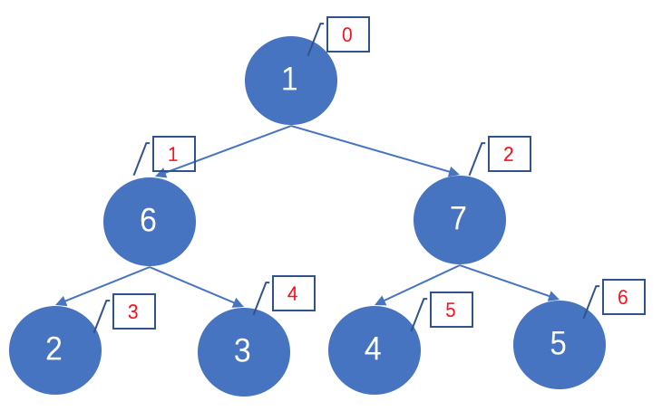
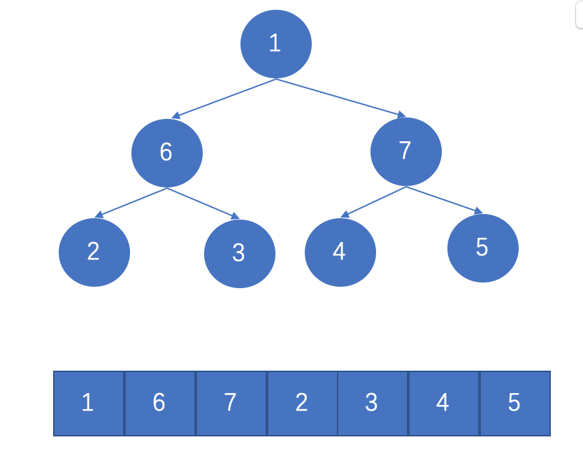

# 堆排序

参考 

- [https://www.cnblogs.com/Java3y/p/8639937.html](https://www.cnblogs.com/Java3y/p/8639937.html)
- [https://www.cnblogs.com/skywang12345/p/3602162.html](https://www.cnblogs.com/skywang12345/p/3602162.html)

堆排序(Heapsort)是指利用堆积树（堆）这种数据结构所设计的一种排序算法，它是选择排序的一种. 堆分为大根堆和小根堆, 是完全二叉树.

**什么是完全二叉树? **
完全二叉树, 即: **Complete Binary Tree**

> A Complete Binary Tree （CBT) is a binary tree in which every level, 
> except possibly the last, is completely filled, and all nodes 
> are as far left as possible.

完全二叉树从根结点到倒数第二层满足完美二叉树，最后一层可以不完全填充，其叶子结点都靠左对齐。

**完全二叉树的性质**

- 左边子结点索引 = 当前父结点索引的2倍 + 1
- 右边子结点索引 = 当前父结点索引的2倍 + 2

**什么是大根堆和小根堆**

`大根堆`又被称为`最大堆`是所有的父结点 >= 子结点, `小根堆`又被称为`最小堆`是所有的父结点 <= 子结点. 大根堆通常被用来进行"升序"排序，而小根堆通常被用来进行"降序"排序. 假设是大根堆, 可知根结点元素一定是这个堆中的最大值.

**思想**
这里讨论使用大根堆进行升序排序的基本思想：
1. 初始化堆：将数列a[1...n]构造成最大堆
2. 交换数据：将a[1]和a[n]交换，使a[n]是a[1...n]中的最大值；然后将a[1...n-1]重新调整为最大堆。 接着，将a[1]和a[n-1]交换，使a[n-1]是a[1...n-1]中的最大值；然后将a[1...n-2]重新调整为最大值。 依次类推，直到整个数列都是有序的.

下面开始堆排序, 这里我们讨论大根堆：当前每个父节点都 >= 子节点.
假设当前元素如下:

我们一层层交换数据, 把最大值7放在根部, 然后把7和数组中最后一位数交换, 这样最大值就在最后一位了, 这就是一趟排序, 然后再对除最后一个元素外的剩下的元素今次处理. 通过不断的建堆，交换....建堆，交换...建堆，交换...建堆，交换..达到排序结果. 

